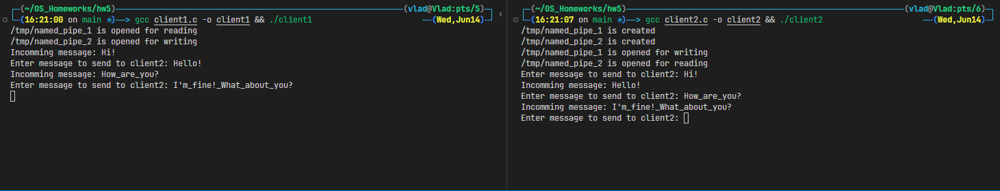

# Homework 5

Сначала нужно запустить client2, он пересоздаст каналы, если те существовали, далее можно запустить client1 и начать общение.

Пример работы:

Обе программы можно закрыть нажатием Ctrl+C.