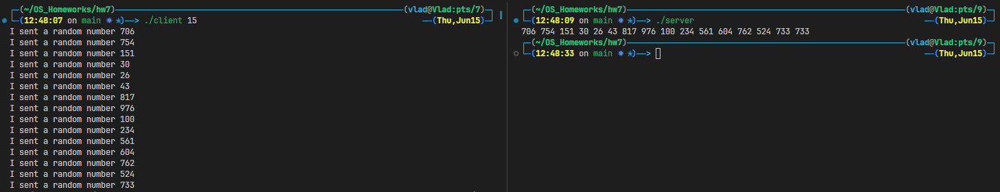

# Пример работы программы

Корректное завершение реализовано так:
1. Если завершение инициировал клиент, то он отсылает сигнал -1 серверу и тот завершает работу, а клиент производит отвязку разделяемой памяти.
2. Если завершение инициировал сервер, то он просто завершает свою работу, в то время как клиент отрабатывает оставшееся число запросов и отвязывает разделяемую память.